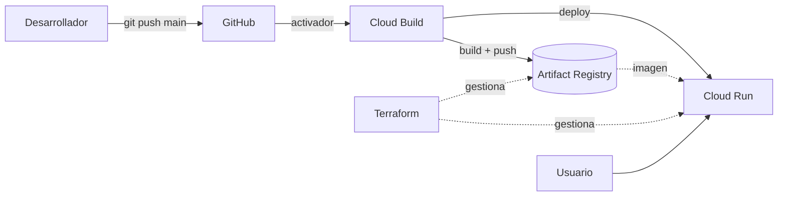

# 🎨 Color Palette Generator

Generador de paletas de color y **design tokens**. Introduces un color base y obtienes una escala de 18 tonos (50–900) lista para exportar como JSON o variables CSS.

**🔗 Demo:** https://color-palette-generator-2dobv4kxqa-no.a.run.app

<!-- TODO: añadir captura de pantalla aquí, por ejemplo:  -->

> Proyecto de portfolio. El foco está en dos cosas: el frontend (lógica de color escrita a mano, sin librerías) y el ciclo completo de entrega: Docker, CI/CD y despliegue con infraestructura como código en Google Cloud.

---

## ✨ Qué hace

- Selector de color nativo y campo HEX **sincronizados** (con validación de entrada).
- Genera una **escala de 11 tonos** (50, 100, 200 … 900) a partir del color base.
- Exporta la escala como **JSON** o como **variables CSS**, con un clic para copiar.
- Nombre del color editable, que se refleja en el export (`--primary-500: #…`).

## 🧱 Stack

| Capa            | Tecnología                                                        |
| --------------- | ----------------------------------------------------------------- |
| Frontend        | Next.js (App Router), React 19, TypeScript                        |
| Estilos         | Emotion (CSS-in-JS)                                               |
| Contenedores    | Docker (multi-stage) y Docker Compose                             |
| CI/CD           | GitHub → Cloud Build                                              |
| Hosting         | Cloud Run + Artifact Registry (Google Cloud, `europe-southwest1`) |
| Infraestructura | Terraform                                                         |

## 🏗️ Arquitectura



**Reparto de responsabilidades:**

- **Terraform** es dueño de la infraestructura: repositorio de imágenes, servicio de Cloud Run y acceso público.
- **Cloud Build** es dueño de qué imagen se ejecuta en cada momento. Cada commit genera una imagen etiquetada con su SHA.

## 🎨 Cómo se calcula la escala

La lógica vive en `lib/colorMath.ts` como funciones puras, sin dependencias:

```
HEX → RGB → HSL → (cambia solo L) → RGB → HEX
```

- El **tono (H)** y la **saturación (S)** se mantienen fijos.
- La **luminosidad (L)** se calcula con `L = 100 - (tone / 10)`, así el tono 50 es muy claro (L=95) y el 900 muy oscuro (L=10).
- `lib/tokens.ts` convierte cada escala en un objeto tipado (`colorTokens`) con los colores del propio proyecto.

## 📁 Estructura

```
.
├── app/
│   ├── layout.tsx            # fuentes (next/font) y metadata
│   ├── providers.tsx         # estilos globales de Emotion (Client Component)
│   ├── page.tsx              # orquesta el estado y compone la UI
│   └── components/
│       ├── ColorInput.tsx    # picker + input HEX sincronizados
│       ├── ToneCard.tsx      # muestra de un tono
│       └── ExportPanel.tsx   # export a JSON / CSS + copiar
├── lib/
│   ├── colorMath.ts          # conversiones y generación de la escala
│   └── tokens.ts             # design tokens del proyecto
├── terraform/                # infraestructura como código
├── Dockerfile                # producción (multi-stage)
├── Dockerfile.dev            # desarrollo con hot reload
├── docker-compose.yml
└── cloudbuild.yaml           # pipeline de CI/CD
```

## 🚀 Empezar en local

Requisitos: Node 20 y, opcionalmente, Docker.

**Con Node:**

```bash
npm install
npm run dev
```

**Con Docker (hot reload):**

```bash
docker compose up
```

La app queda en http://localhost:3000.

**Probar la imagen de producción:**

```bash
docker build --platform linux/amd64 -t color-palette-generator .
docker run -p 3000:3000 color-palette-generator
```

> En Mac con Apple Silicon hace falta `--platform linux/amd64`: Cloud Run solo acepta imágenes amd64.

## ☁️ Despliegue

### CI/CD

Cada `git push` a `main` dispara un activador de Cloud Build que ejecuta `cloudbuild.yaml`:

1. **Build** de la imagen Docker.
2. **Push** a Artifact Registry, etiquetada con `$COMMIT_SHA`.
3. **Deploy** de esa imagen a Cloud Run.

Un cambio tarda unos 3 minutos en llegar a producción.

La cuenta de servicio del build necesita estos roles: `run.admin`, `artifactregistry.writer`, `iam.serviceAccountUser` y `logging.logWriter`.

### Infraestructura con Terraform

```bash
cd terraform
terraform init
terraform plan
terraform apply
```

Recursos que gestiona: `google_artifact_registry_repository`, `google_cloud_run_v2_service` y `google_cloud_run_service_iam_member` (acceso público).

**Primer despliegue en un proyecto vacío:** Cloud Run necesita que la imagen ya exista, así que el orden es:

1. `terraform apply -target=google_artifact_registry_repository.color_palette_repo`
2. Construir y subir la imagen (o lanzar el pipeline).
3. `terraform apply` completo.

## 🧠 Decisiones técnicas

| Decisión                                   | Motivo                                                                                          |
| ------------------------------------------ | ----------------------------------------------------------------------------------------------- |
| Algoritmo HSL propio, sin librerías        | Entender la matemática del color y no añadir dependencias.                                      |
| La escala es **estado derivado**           | Se calcula desde `baseHex` en cada render; evita un `useState` + `useEffect` y un render extra. |
| Estado lo más cerca posible de su uso      | El formato de export vive en `ExportPanel`, no en la página.                                    |
| Emotion en lugar de Tailwind               | Estilos tipados y colocados junto al componente.                                                |
| Tag de imagen = SHA del commit             | Cada despliegue es trazable y se puede volver a una versión anterior.                           |
| `lifecycle.ignore_changes` sobre la imagen | Terraform no debe revertir lo que Cloud Build despliega.                                        |
| Imagen multi-stage                         | La imagen final solo lleva lo necesario para ejecutar.                                          |

## 🗺️ Roadmap

- [ ] Estado de Terraform remoto (bucket en Cloud Storage).
- [ ] Definir el activador de Cloud Build también en Terraform.
- [ ] Cuenta de servicio dedicada al build, con permisos mínimos.
- [ ] Filtro de rutas en el activador (no reconstruir si solo cambia `terraform/` o la documentación).
- [ ] Dominio propio.

## 👤 Autor

**Juanan Amate**, desarrollador frontend (React, React Native, Next.js) · GitHub: [@amat3](https://github.com/amat3)
